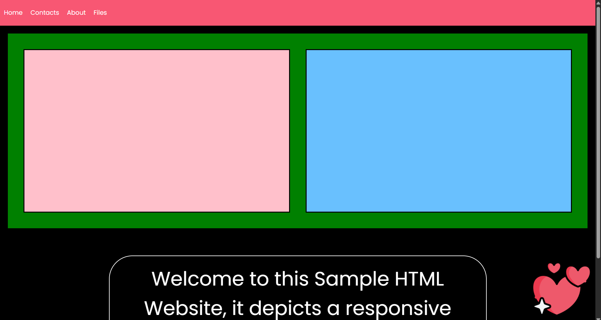
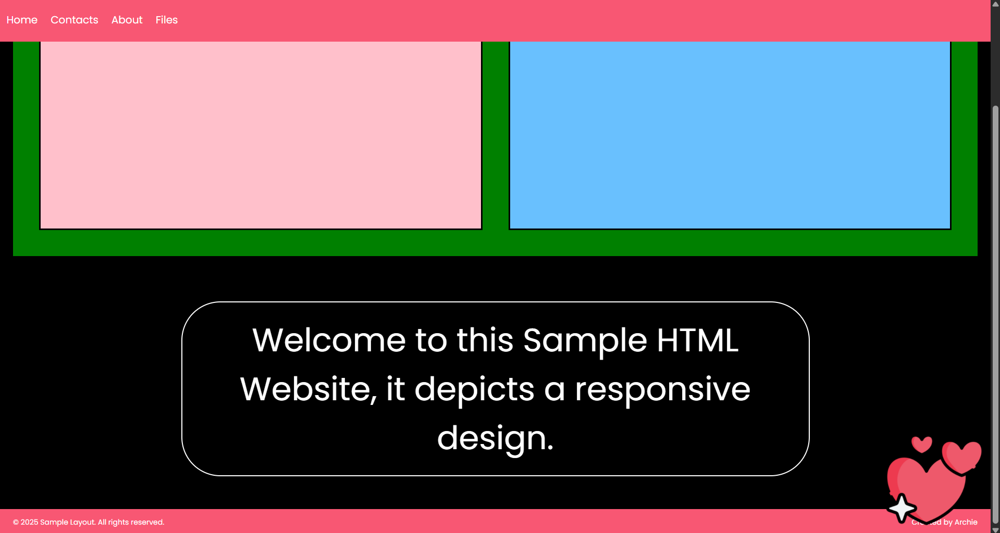

# Responsive Sample HTML Layout

This is a simple, responsive HTML + CSS project that demonstrates a clean layout adaptable to both desktop and mobile devices. The design is minimal yet functional, featuring a sticky navigation bar, responsive sections, and a styled footer.

---

## 🔍 Project Features

- **Sticky Navigation Bar**  
  A top-fixed nav bar that remains visible while scrolling.
  
- **Responsive Layout**  
  The layout dynamically adapts for screens under `768px` using CSS media queries. The content stacks vertically and font sizes shrink for better readability on mobile devices.

- **Flexbox Used Throughout**  
  Flexbox is heavily used to align elements like the nav bar (`ul`), main sections (`main`), centered text (`div > p`), and footer.

- **Styled Components**  
  - Custom font (`Poppins`) via Google Fonts  
  - Colored sections for contrast  
  - Circular-bordered central welcome message  
  - Sticky footer with distributed content  
  - Fixed-positioned image in the bottom-right corner

---

## 📱 Mobile-Friendly Implementation

This site is mobile-friendly due to:

- **Media Queries**:  
  At `max-width: 768px`, the following changes occur:
  - Nav items stack vertically
  - Content sections resize to fit narrow screens
  - Font sizes and padding are reduced
  - Fixed image (`#logo`) shrinks and adjusts position
  - Overflow-x is prevented to eliminate horizontal scroll

- **Responsive Units**:  
  Layout sizing uses `vw`, `vh`, and `%` to scale dynamically.

- **Box Sizing**:  
  `box-sizing: border-box` is applied universally to manage padding and border dimensions efficiently.

---

## 🧠 Technologies Used

- **HTML5**
- **CSS3**
  - Flexbox
  - Media Queries
  - Pseudo-classes (`:hover`)
  - Fixed & Sticky positioning

---

## 🌐 Live Demo

👉 [View Live Website](https://archiep27.github.io/Sample-MobileFriendlyLayout/)  

---

## 📸 Screenshots

### 💻 Desktop View

### 📱 Mobile View

---

